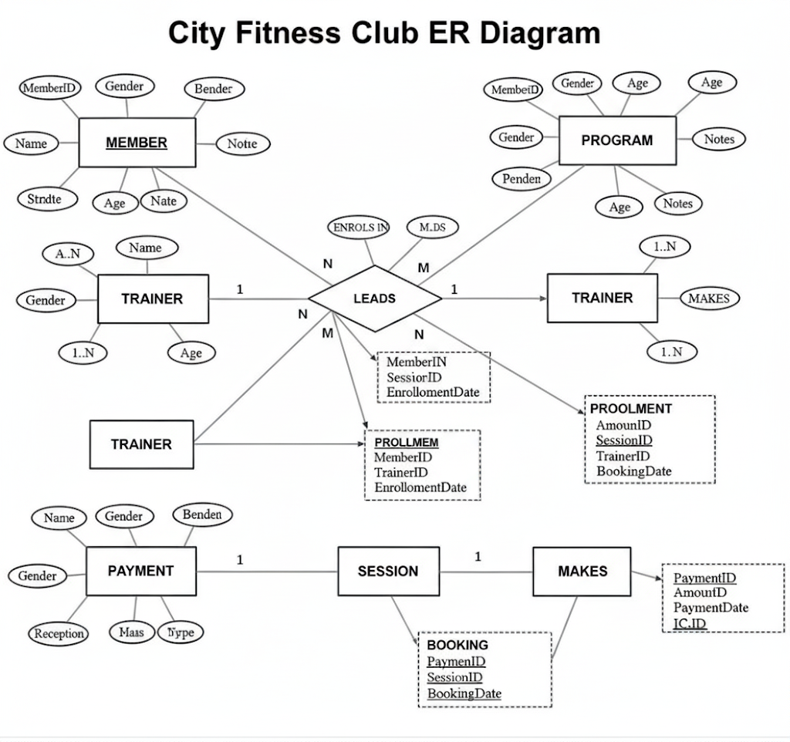
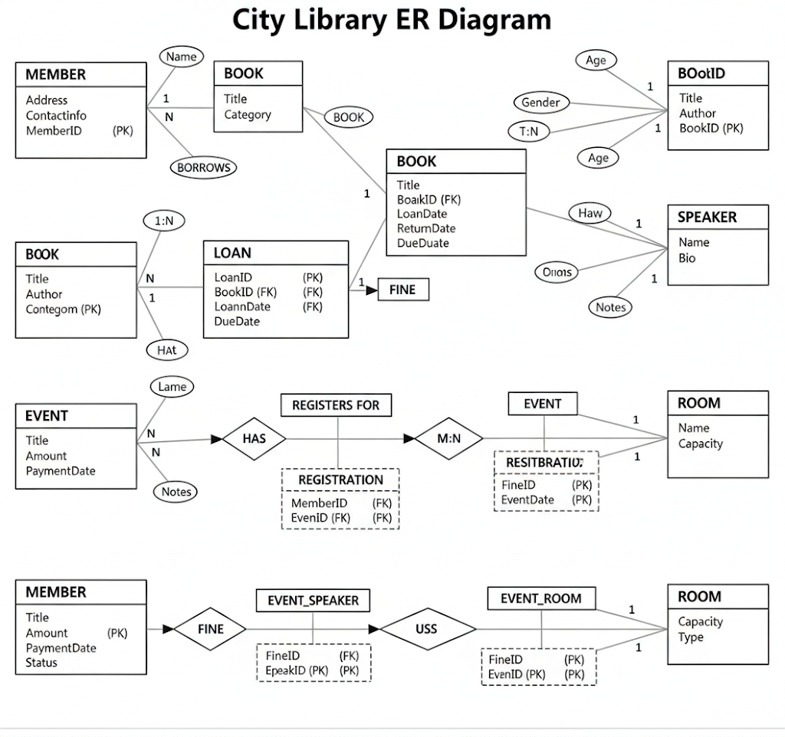
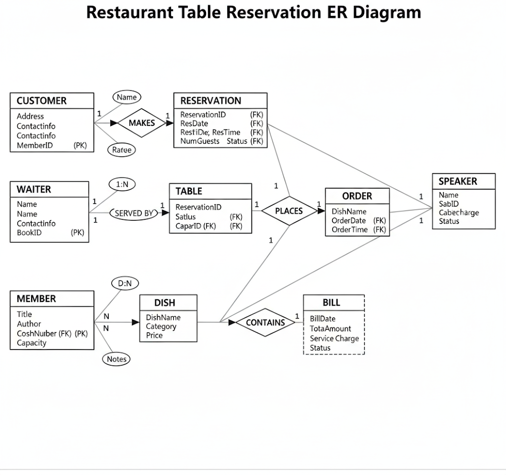

# ER Diagram Workshop – Submission Template

## Objective
To understand and apply ER modeling concepts by creating ER diagrams for real-world applications.

## Purpose
Gain hands-on experience in designing ER diagrams that represent database structure including entities, relationships, attributes, and constraints.

---

# Scenario A: City Fitness Club Management

**Business Context:**  
FlexiFit Gym wants a database to manage its members, trainers, and fitness programs.

**Requirements:**  
- Members register with name, membership type, and start date.  
- Each member can join multiple programs (Yoga, Zumba, Weight Training).  
- Trainers assigned to programs; a program may have multiple trainers.  
- Members may book personal training sessions with trainers.  
- Attendance recorded for each session.  
- Payments tracked for memberships and sessions.

### ER Diagram:
*Paste or attach your diagram here*  

### Entities and Attributes

| Entity | Attributes (PK, FK) | Notes |
|--------|--------------------|-------|
Member	  |      MemberID (PK), Name, MembershipType, StartDate	|Gym member details.
Program	   |     ProgramID (PK), ProgramName	|Fitness program details.
Trainer	   |     TrainerID (PK), Name, Specialization	|Fitness trainer info.
Session	   |     SessionID (PK), SessionDate, SessionTime, Status	|Personal training session details.
Payment	    |    PaymentID (PK), MemberID (FK), Amount, PaymentDate, PaymentType	|Financial transaction tracking.
Enrollment  |    MemberID (FK, PK), ProgramID (FK, PK)	|Links members to programs.
ProgramAssignment	|TrainerID (FK, PK), ProgramID (FK, PK)	|Links trainers to programs.
Booking	     |   MemberID (FK, PK), TrainerID (FK, PK), SessionID (FK, PK)	|Links members, trainers, sessions.
### Relationships and Constraints

| Relationship | Cardinality | Participation | Notes |
|--------------|------------|---------------|-------|
Member ENROLLS IN Program	M:N	Total (Enrollment), Partial (Member, Program)	Members can join multiple programs; programs have multiple members.
Trainer LEADS Program	M:N	Partial (Trainer), Total (Program)	Trainers lead multiple programs; programs have multiple trainers.
Member BOOKS Session WITH Trainer	M:N	Partial (Member, Trainer), Total (Session)	Members book sessions with trainers; trainers conduct sessions.
Member MAKES Payment	1:N	Total (Payment), Partial (Member)	Payments by a member; a member makes many payments.

### Assumptions
IDs are primary keys and unique.

Junction tables resolve all M:N relationships.

Session status covers attendance.

---

# Scenario B: City Library Event & Book Lending System

**Business Context:**  
The Central Library wants to manage book lending and cultural events.

**Requirements:**  
- Members borrow books, with loan and return dates tracked.  
- Each book has title, author, and category.  
- Library organizes events; members can register.  
- Each event has one or more speakers/authors.  
- Rooms are booked for events and study.  
- Overdue fines apply for late returns.

### ER Diagram:

### Entities and Attributes

| Entity | Attributes (PK, FK) | Notes |
|--------|--------------------|-------|

Member	        MemberID (PK), Name, Address, ContactInfo	    Library patron details.
Book	        BookID (PK), Title, Author, Category	        Cataloged book details.
Loan	        LoanID (PK), BookID (FK), MemberID (FK), LoanDate, ReturnDate, DueDate	    Records book borrowing.
Fine	        FineID (PK), LoanID (FK), Amount, PaymentDate, Status	            Tracks overdue penalties.
Event	        EventID (PK), EventName, EventDate, EventTime	    Library cultural event info.
Speaker 	    SpeakerID (PK), Name, Bio	                        Details of event speakers/authors.
Room	        RoomID (PK), RoomNumber, Capacity, Type	Library room details (e.g., event, study).
Registration	MemberID (FK, PK), EventID (FK, PK), RegistrationDate	Links members to events.
EventSpeaker	EventID (FK, PK), SpeakerID (FK, PK)	    Links events to speakers.
EventRoom	    EventID (FK, PK), RoomID (FK, PK), BookingDate	    Links events to rooms used.

### Relationships and Constraints

| Relationship | Cardinality | Participation | Notes |
|--------------|------------|---------------|-------|
Member BORROWS Book	1:N	Total (Loan), Partial (Member, Book)	One member, many loans; one book, many loans.
Loan HAS Fine	1:1	Partial (Loan, Fine)	A loan may or may not have an associated fine.
Member REGISTERS for Event	M:N	Total (Registration), Partial (Member, Event)	Many members, many events.
Event HAS Speaker	M:N	Total (EventSpeaker), Partial (Event, Speaker)	Many events, many speakers.
Event USES Room	M:N	Total (EventRoom), Partial (Event, Room)	Many events, many rooms.

### Assumptions
Each book copy is unique via BookID.

Fines are only for late returns.

Rooms can serve multiple purposes (events, study).

M:N relationships are resolved with junction tables.

All IDs are unique primary keys.
---

# Scenario C: Restaurant Table Reservation & Ordering

**Business Context:**  
A popular restaurant wants to manage reservations, orders, and billing.

**Requirements:**  
- Customers can reserve tables or walk in.  
- Each reservation includes date, time, and number of guests.  
- Customers place food orders linked to reservations.  
- Each order contains multiple dishes; dishes belong to categories (starter, main, dessert).  
- Bills generated per reservation, including food and service charges.  
- Waiters assigned to serve reservations.

### ER Diagram:

### Entities and Attributes

| Entity | Attributes (PK, FK) | Notes |
|--------|--------------------|-------|

Customer	    CustomerID (PK), Name, ContactInfo	Details of the restaurant's customers.
Table	        TableID (PK), TableNumber, Capacity, Status	Restaurant table details (e.g., available, occupied).
Reservation 	ReservationID (PK), CustomerID (FK), TableID (FK), ResDate, ResTime, NumGuests, Status	Details for a table reservation.
Waiter	        WaiterID (PK), Name, ContactInfo	Details of restaurant staff serving tables.
Dish	        DishID (PK), DishName, Category, Price	Menu items (e.g., Starter, Main, Dessert).
Order	        OrderID (PK), ReservationID (FK), OrderDate, OrderTime, Status	A customer's food order.
Bill	        BillID (PK), ReservationID (FK), BillDate, TotalAmount, ServiceCharge, Status	Financial bill for a reservation.
OrderLine	    OrderID (FK, PK), DishID (FK, PK), Quantity, Subtotal	Details of dishes within an order.

### Relationships and Constraints

| Relationship | Cardinality | Participation | Notes |
|--------------|------------|---------------|-------|
Customer MAKES Reservation FOR Table	1:N for Customer-Reservation, 1:N for Table-Reservation	Partial (Customer, Table), Total (Reservation)	A customer can make many reservations; a table can have many reservations over time. Each reservation is for one customer and one table.
Reservation IS SERVED BY Waiter	M:N	Partial (Reservation, Waiter)	A reservation can be served by multiple waiters; a waiter can serve multiple reservations.
Reservation PLACES Order	1:N	Total (Order), Partial (Reservation)	Each order is linked to one reservation; a reservation can have multiple orders.
Order CONTAINS Dish	M:N	Total (OrderLine), Partial (Order, Dish)	An order can contain multiple dishes; a dish can be in multiple orders.
Reservation GENERATES Bill	1:1	Total (Bill), Partial (Reservation)	Each reservation generates exactly one bill.

### Assumptions
Table Assignment: A reservation is assigned to one specific table. Walk-in customers might create a reservation record on the spot.

Order-Reservation Link: Every order must be associated with an existing reservation.

Dish Category: Each dish belongs to a single category.

Bill Generation: A single bill is generated per reservation, encompassing all orders for that reservation.

Waiter Assignment: Waiters can be assigned to multiple reservations, and a single reservation might have multiple waiters over its duration (e.g., shift changes).

All IDs are unique primary keys.
---

## Instructions for Students

1. Complete **all three scenarios** (A, B, C).  
2. Identify entities, relationships, and attributes for each.  
3. Draw ER diagrams using **draw.io / diagrams.net** or hand-drawn & scanned.  
4. Fill in all tables and assumptions for each scenario.  
5. Export the completed Markdown (with diagrams) as **a single PDF**
